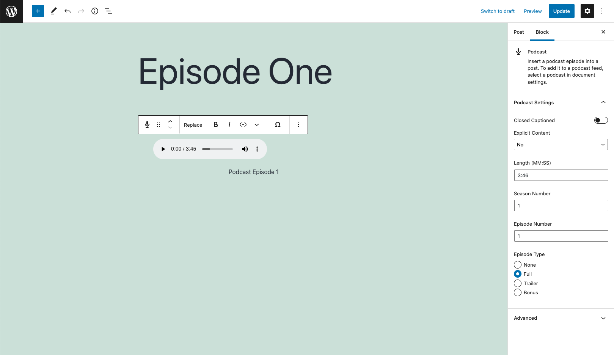
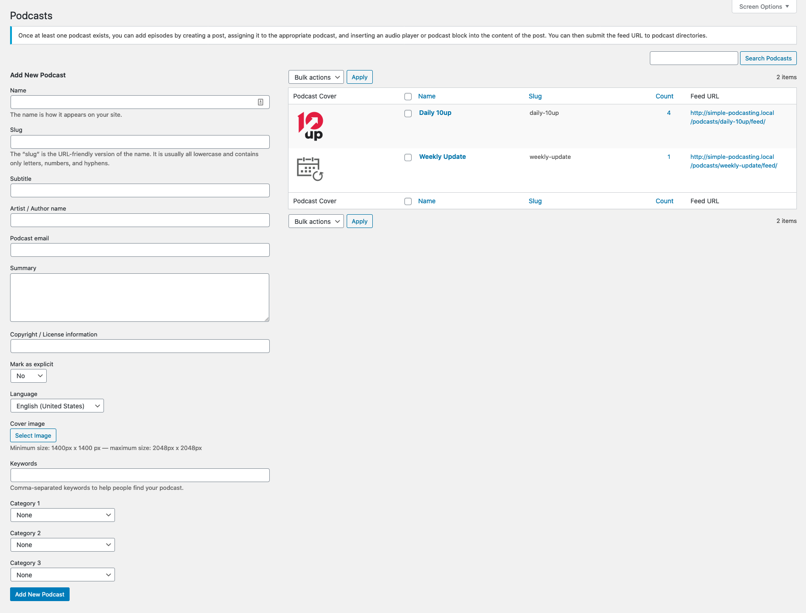
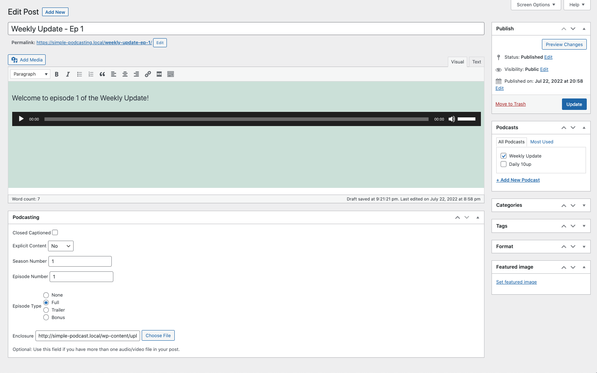
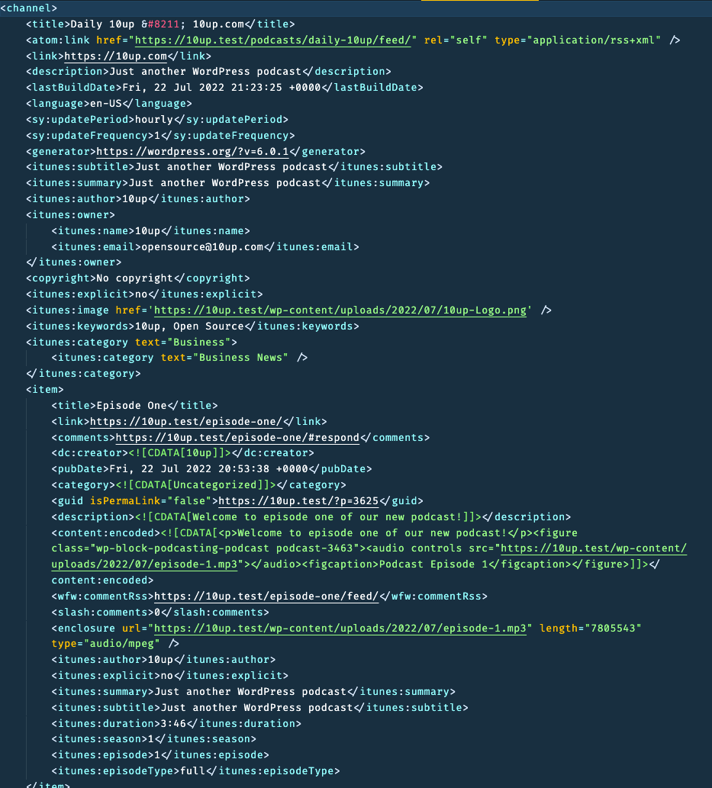

# Simple Podcasting for WordPress

> Easily set up multiple podcast feeds using built-in WordPress posts. Includes a podcast block for the WordPress block editor (aka Gutenberg).

   

## Table of Contents
* [Overview](#overview)
* [Requirements](#requirements)
* [Installation](#installation)
* [Create Podcast](#create-your-podcast)
* [Add Content to Podcast](#add-content-to-your-podcast)
* [Submit Podcast Feed to Apple Podcasts](#submit-your-podcast-feed-to-apple-podcasts)
* [Contributing](#contributing)

## Overview

Podcasting is a method to distribute audio messages through a feed to which listeners can subscribe. You can publish podcasts on your WordPress site and make them available for listeners in Apple Podcasts and through direct feed links for other podcasting apps by following these steps:

## Requirements

* PHP 5.3+
* [WordPress](http://wordpress.org) 4.6+
* RSS feeds must not be disabled

## Installation

1. Install the plugin via the plugin installer, either by searching for it or uploading a .zip file.
2. Activate the plugin.
3. Head to Posts → Podcasts and add at least one podcast.
4. Create a post and insert an audio embed (or a podcast block in the new WordPress editor) and select a Podcast feed to include it in.

## Create your podcast

From the WordPress Admin, go to Podcasts.
To create a podcast, complete all of the "Add New Podcast" fields and click "Add New Podcast".

 * Name: this title appears in Apple Podcasts and any other podcast apps.
 * Slug: this is the URL-friendly version of the Name field.
 * Subtitle: the subtitle also appears in Apple Podcasts and any other podcast apps.
 * Artist / Author name: the artist or producer of the work.
 * Podcast email: a contact email address for your podcast.
 * Summary: Apple Podcasts displays this summary when browsing through podcasts.
 * Copyright / License information: copyright information viewable in Apple Podcasts or other podcast apps.
 * Mark as explicit: mark Yes if podcast contains adult language or adult themes.
 * Language: the main language spoken in the podcast.
 * Cover image: add the URL for the cover art to appear in Apple Podcasts and other podcast apps. Click "Select Image" and choose an image from the Media Library. Note that podcast cover images must be between 1400 x 1400 and 3000 x 3000 pixels in JPG or PNG formats to work on Apple Podcasts.
 * Keywords: add terms to help your podcast show up in search results on Apple Podcasts and other podcast apps.
 * Categories: these allow your podcast to show up for those browsing Apple Podcasts or other podcast apps by category.

Repeat for each podcast you would like to create.

## Add content to your podcast

 * Create a new post and assign it to one or more Podcasts using the panel labeled Podcasts.
 * Upload or embed an audio file into this post using any of the usual WordPress methods. If using the new block-based WordPress editor (sometimes referred to as Gutenberg), insert a Podcast block. Only one Podcast block can be inserted per post.
 * For more advanced settings, use the Podcasting meta box to mark explicit content or closed captioning available and to optionally specify one media item if the post if you have more than one in your post. In the block-based editor, these are the block settings that appear in the sidebar when the podcast block is selected.

## Submit your podcast feed to Apple Podcasts

* Each podcast has a unique feed URL you can find on the Podcasts page. This is the URL you will submit to Apple.
* Ensure you test feeds before submitting them, see https://help.apple.com/itc/podcasts_connect/#/itcac471c970.
* Once the validator passes, submit your podcast. Podcasts submitted to Apple Podcasts do not become immediately available for subscription by others. They are submitted for review by Apple staff, see https://help.apple.com/itc/podcasts_connect/#/itcd88ea40b9

Podcast setup | Podcast in editor | Podcast feed
------------- | ----------------- | ------------
 |  | 

## Support Level

**Active:** 10up is actively working on this, and we expect to continue work for the foreseeable future including keeping tested up to the most recent version of WordPress.  Bug reports, feature requests, questions, and pull requests are welcome.

## Changelog

A complete listing of all notable changes to Simple Podcasting for WordPress are documented in [CHANGELOG.md](https://github.com/10up/simple-podcasting/blob/develop/CHANGELOG.md).

## Contributing

Please read [CODE_OF_CONDUCT.md](https://github.com/10up/simple-podcasting/blob/develop/CODE_OF_CONDUCT.md) for details on our code of conduct, [CONTRIBUTING.md](https://github.com/10up/simple-podcasting/blob/develop/CONTRIBUTING.md) for details on the process for submitting pull requests to us, and [CREDITS.md](https://github.com/10up/simple-podcasting/blob/develop/CREDITS.md) for a listing of maintainers of, contributors to, and libraries used by Simple Podcasting for WordPress.

## Like what you see?

